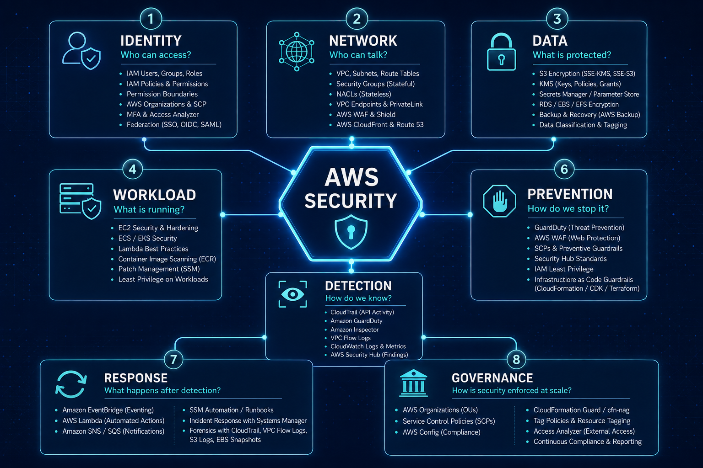

# A Mental Map to Build Secure AWS Architectures.

> You can know IAM, KMS, VPC, GuardDuty, CloudTrail, WAF, and dozens of other AWS services - and still struggle when you have to design a secure architecture or assess a real-world scenario.
> ### The problem is often not knowledge. It is knowing how to connect the knowledge.

---



### The gap between knowing and applying

A common experience looks like this.

You study a concept. You understand it. You can explain it when someone asks you directly.

Then you are given a scenario:

> **"Design a secure AWS architecture for a production web application."**

Suddenly, everything you know feels disconnected.

You start wondering where to begin. Should you start with IAM? The VPC? KMS? WAF? GuardDuty? Organizations?

This happens because there is a difference between **knowing individual concepts** and **using those concepts to reason about a system**.

The missing layer is:

**Knowledge → Situation recognition → Reasoning → Architecture → Explanation**

The goal is to strengthen the middle of that chain.

---

### Why this happens

AWS is often learned as a collection of services:

- IAM
- VPC
- Security Groups
- KMS
- S3
- CloudTrail
- GuardDuty
- Security Hub
- WAF
- Organizations
- Config
- Secrets Manager

This is useful when learning the platform.

But real-world scenarios rarely present themselves as isolated service questions.

You are more likely to encounter something like:

> "The application handles sensitive customer data. How would you secure it?"

Now you have to **derive** the solution.

Instead of remembering:

> **KMS → encryption**

you need to think:

> **Sensitive data → protection requirement → encryption → key management → access control → auditing**

That is a very different kind of knowledge.

---

## The AWS Security Mental Map

When looking at a broad AWS security problem, don't immediately start naming services.

Start with the problem.

A useful mental map is:

```text
                         AWS SECURITY
                              │
       ┌──────────────────────┼──────────────────────┐
       │                      │                      │
   1. IDENTITY            2. NETWORK             3. DATA
   Who can access?        Who can talk?           What is protected?
       │                      │                      │
     IAM                  VPC / SG               KMS
     Roles                NACL                   S3
     Policies             WAF                    Secrets Manager
     SCP                  Endpoints              TLS
       │                      │                      │
       └──────────────────────┼──────────────────────┘
                              │
       ┌──────────────────────┼──────────────────────┐
       │                      │                      │
  4. WORKLOAD            5. DETECTION           6. PREVENTION
  What is running?       How do we know?        How do we stop it?
       │                      │                      │
     EC2 / ECS             CloudTrail             IAM
     EKS                   GuardDuty              SCP
     Lambda                Security Hub           WAF
     Containers            VPC Flow Logs           SG
       │                      │                      │
       └──────────────────────┼──────────────────────┘
                              │
       ┌──────────────────────┴──────────────────────┐
       │                                             │
  7. RESPONSE                                  8. GOVERNANCE
  What happens after detection?                How is security
                                               enforced at scale?
       │                                             │
  EventBridge                                    Organizations
  Lambda                                         SCP
  Isolation                                       Config
  Credential rotation                             Centralized logging
  Investigation                                  Security Hub
```

The point of this map is not to memorize eight boxes.

It gives you somewhere to start when the problem is broad or unfamiliar.

---

## 1. Identity - Who can access what?

Start by asking:

> **Who is accessing the resource, and what should they be allowed to do?**

This naturally leads to IAM roles and policies, least privilege, federation, resource-based policies, SCPs, permission boundaries, and temporary credentials.

Consider a simple example:

> An EC2 instance needs to read objects from an S3 bucket.

Instead of immediately listing AWS services, reason through it.

The EC2 workload needs an identity. An IAM role can provide that identity. The role should have only the S3 permissions it actually needs, scoped to the required resources.

You can then ask whether additional conditions or organizational controls are needed.

The important part is that **the requirement led you to the control**.

---

## 2. Network - Who can communicate with what?

Once you understand the identities involved, look at communication.

Ask:

> **Which components need to communicate, and what should be isolated?**

This brings in VPCs, subnets, Security Groups, NACLs, route tables, VPC endpoints, load balancers, WAF, and other network controls.

Consider:

> A database should not be directly reachable from the internet.

The answer starts with the communication requirement, not a list of services.

A simple design might look like:

```text
Internet
   │
   ▼
Public-facing layer
   │
   ▼
Application layer
   │
   ▼
Private database
```

Then you can reason about the details:

Does the database need a public IP? Which components should be able to reach it? Which ports are required? Does the application need outbound internet access? Can AWS service traffic use private endpoints?

The principle is simple:

> **Network design follows communication requirements.**

---

## 3. Data - What are we protecting?

Now ask:

> **What data matters, and what happens if it is exposed or modified?**

This leads to questions around encryption, KMS, secrets, certificates, data classification, and backup protection.

For example:

> An application stores customer financial information.

Rather than jumping straight to KMS, first identify the problem.

The data is sensitive. Unauthorized disclosure is a concern. Therefore, encryption at rest and in transit may be required. Key access should be controlled. Key usage should be auditable.

KMS may be part of that design, but it is there because of the requirement - not because the question happened to mention AWS security.

---

## 4. Workload - What is actually running?

Infrastructure security doesn't end at the VPC.

Ask:

> **What is the workload, and how can it be compromised?**

The answer depends on whether you are running EC2, ECS, EKS, Lambda, containers, or something else.

For an EC2-based application, for example, you might need to think about provisioning, patching, AMIs, instance permissions, credentials, vulnerabilities, and runtime activity.

If the scenario says:

> "The company runs applications on EC2."

Don't stop at knowing what EC2 is.

Start asking:

> How are these instances provisioned and patched? What permissions do they have? Are credentials being stored on them? How are vulnerabilities detected? What happens if one of them is compromised?

The question has changed from:

> **"What is EC2?"**

to:

> **"What can go wrong with this workload, and how do I control it?"**

---

## 5. Detection - How do we know something went wrong?

Security is not only about preventing an attack.

Ask:

> **If an attacker succeeds, how will we know?**

This is where services such as CloudTrail, GuardDuty, Security Hub, Config, VPC Flow Logs, CloudWatch, and SIEM integrations become relevant.

A useful distinction is:

```text
Prevention  → Stop or limit the attack
Detection   → Identify the attack
Response    → Contain and recover
```

For example, suppose someone obtains an AWS credential and starts making suspicious API calls.

You can reason through it:

The activity needs to be recorded. CloudTrail provides API activity visibility. GuardDuty can identify certain suspicious behaviors. Security Hub can provide a central place for security findings.

Again, the important part is the relationship between the problem and the controls.

---

## 6. Prevention - How do we stop or limit it?

Once you understand the threat, ask:

> **What controls can prevent it or reduce its impact?**

Prevention can happen at multiple layers.

At the identity layer, that might mean least privilege, SCPs, MFA, or temporary credentials.

At the network layer, it could mean Security Groups, private subnets, WAF, or Network Firewall.

At the data layer, it could mean encryption, key policies, bucket policies, and access controls.

At the workload layer, it could mean hardening, patching, image scanning, and runtime controls.

This is where **defense in depth** becomes practical.

You are not looking for one perfect control. You are building several controls that limit the impact if one control fails.

---

## 7. Response - What happens after detection?

A mature security design also asks:

> **What happens after we detect an incident?**

Think of the flow:

```text
Detection
    │
    ▼
Finding / Alert
    │
    ▼
Event / Automation
    │
    ▼
Containment
    │
    ▼
Investigation
    │
    ▼
Recovery
```

For example, if GuardDuty detects suspicious activity from an EC2 instance, the response should not end with "an alert is generated."

You should think about how the finding reaches the security team, whether EventBridge can trigger automation, how the instance could be isolated, whether credentials need to be rotated, how evidence is preserved, and how the workload is safely rebuilt.

This turns a security tool into part of a **security response design**.

---

## 8. Governance - How is security enforced at scale?

Security becomes a different problem when the environment grows.

Ask:

> **What happens when one AWS account becomes 50 or 500 accounts?**

Manually configuring every account does not scale.

Now you start thinking about AWS Organizations, SCPs, centralized logging, GuardDuty, Security Hub, Config, and dedicated security or audit accounts.

The mental model becomes:

```text
AWS Organization
       │
       ├── Preventive controls
       │       └── SCPs
       │
       ├── Detective controls
       │       ├── Config
       │       ├── GuardDuty
       │       └── Security Hub
       │
       └── Centralized visibility
               └── CloudTrail / logging
```

The important insight is:

> **Security at scale is not just about securing individual resources. It is about enforcing and monitoring security consistently across the environment.**

---

# A second mental model: Why → What → How → Tradeoff

Once you identify the security problem, another simple framework helps turn your reasoning into a clear design.

| Step | Question | Example — EC2 Credentials |
|---|---|---|
| **Why?** | What is the security problem? | Avoid hardcoding long-lived AWS credentials in the application. |
| **What?** | Which capability addresses it? | Use an IAM role for the EC2 instance. |
| **How?** | How would you actually implement it? | Attach a least-privilege role that permits only the required AWS API operations and resources. The workload can obtain temporary credentials rather than storing long-lived access keys. |
| **Tradeoff?** | What limitation, alternative, or design consideration should you mention? | If the application needs an application secret rather than AWS credentials, a service such as Secrets Manager may be more appropriate. |

This is much stronger than simply saying:

> "Use IAM roles because they are more secure."

---

# A simple way to practice

When you encounter a new AWS scenario, don't immediately look for the answer.

Take a minute and ask:

```text
Who needs access?
What needs to communicate?
What data needs protection?
What workload is running?
How would I detect something going wrong?
How would I prevent or limit it?
What happens after detection?
How would I enforce this at scale?
```

You may not have a complete answer. That's fine. The gaps tell you exactly what you need to learn. Then look at the solution, identify the connections you missed, and try the same scenario again. Over time, the individual AWS services stop feeling like isolated pieces. They start forming a system in your head.

---

### Closing Thought 🧠

Knowing AWS is the foundation. Knowing **when and why to use what you know** is the actual engineering skill. Don't aim to memorize better architectures. Aim to build a mental map that lets you **derive better architecture**.

Because in the real world, the exact scenario may be something you've never seen before. Your knowledge might not contain the answer. But a good reasoning framework can still help you get there.

---

### 📢 Share this post

[](https://twitter.com/intent/tweet?text=Checkout%20this%20post%20by%20Dhananjay%20Bhujbal%20...%20Secure%20AWS%20Architecture%20Mental%20Map&url=https://onemorelens.co.in/posts/Cloud-Security/10-08-2026-secure-aws-architecture-mental-map.html)


[](https://www.linkedin.com/sharing/share-offsite/?url=https://onemorelens.co.in/posts/Cloud-Security/10-08-2026-secure-aws-architecture-mental-map.html)


[](https://api.whatsapp.com/send?text=Checkout%20this%20post%20by%20Dhananjay%20Bhujbal%20...%20Secure%20AWS%20Architecture%20Mental%20Map.%20https://onemorelens.co.in/posts/Cloud-Security/10-08-2026-secure-aws-architecture-mental-map.html)