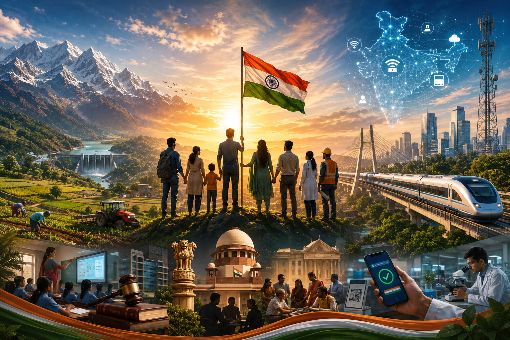

# My View On Nation Building As A Non-partisan Indian

## Geography

Nation building starts with something we cannot change - geography.

India's varied terrain and climate create clear constraints on taking public infrastructure to the last mile. Agriculture faces similar challenges - drought in one region, floods in another, and limited natural resources.

Technology and region-specific strategies can help, but they cannot eliminate these constraints.

*Geography sets the limits; how we work around them sets the pace of progress.*

## Political, Bureaucratic & Institutional Systems

People often confuse the nation with the government. They are not the same.

In a democracy, political parties compete through elections and the elected government is expected to work in the nation's interest. Institutions such as the Election Commission, administrative services, judiciary and other agencies provide the framework that makes this possible.

Bureaucracy is the critical link between policy and ground reality. Its efficiency determines whether policies actually reach the people they are meant for.

The more these institutions remain professional and insulated from short-term political interests, while remaining accountable, the stronger the foundation for long-term nation building.

## Citizens

But the core of all this is citizens.

I believe citizens' role is at least as important as that of all other factors combined. Their responsibilities can be viewd from four angles as below

**Economic:** skill acquisition, productivity, tax compliance, entrepreneurship and willingness to compete rather than constantly seek protection.

**Civic:** knowing our rights, respecting rules and others' rights, participating in local governance, rejecting everyday corruption and raising the next generation with better human capital.

**Social:** maintaining coexistence across linguistic, religious and caste differences without constantly turning differences into fractures.

**Political:** informed voting and holding governments accountable for performance rather than only identity or patronage.

In the long run, **human capital decides the direction in which a nation moves.**

## Public Infrastructure

India deserves immense appreciation for its digital public infrastructure. Our digital payments ecosystem, in particular, is among the world's most impressive at scale.

Physical infrastructure - roads, railways, telecom, etc. - is broadly functional and improving.

But **social infrastructure still needs far greater attention**, especially healthcare, education and sanitation. Access alone isn't enough. The quality of these systems directly determines opportunity and, ultimately, the pace of progress.

## Closing Thought

I don't think nation building belongs to any one political party or government.

Governments change. Policies change. Technology changes.

**The country remains.**

So for me, nation building is ultimately about continuously improving India's **human capital, institutions, infrastructure, productivity and social cohesion** - so that the country we leave for the next generation is stronger than the one we inherited.

That's the lens through which I think about it.