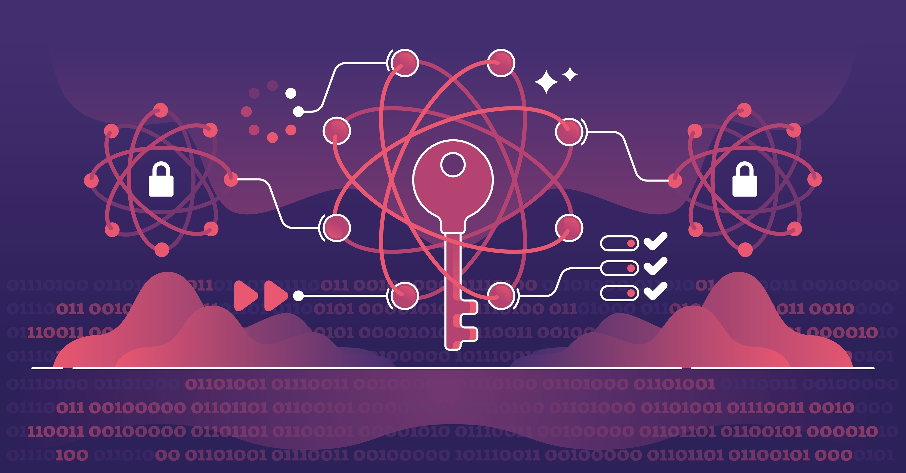

# Post-Quantum Cryptography: Where We Stand Today

Quantum cryptography and post-quantum cryptography (PQC) are vast topics on their own. This post is intended to be a **high-level introduction**.

The goal here is to build a clear understanding of how quantum computing is expected to impact the current state of cryptography, and what that means in practice.

If you are a cybersecurity leader, this should help you start thinking about **long-term migration and strategy**.  
If you are an implementation engineer, this should give you a **strong foundational understanding** of the concepts involved.

This is just the starting point - we will go deeper into implementation, architecture, and practical adoption in upcoming posts. Stay tuned for more implementation-focused deep dives.

*Image Credit: VectorMine/Shutterstock*

## Current State of Cryptography

If we look at modern systems today, almost everything we rely on for secure communication is built on a small set of well-established cryptographic primitives.

Protocols like TLS, SSH, and VPNs depend heavily on:
- RSA
- Elliptic Curve Cryptography (ECC)
- Symmetric encryption (like AES)

The security of RSA and ECC comes from mathematical problems that are **computationally hard for classical computers** - such as factoring large numbers or solving discrete logarithms.

For decades, this assumption has held strong. It’s the reason why we can safely:
- Browse websites over HTTPS (TLS)
- Authenticate users (MAC)
- Secure APIs and infrastructure (SSL/TLS, SSH)

In simple terms, today’s cryptography works because **breaking it would take impractical amounts of time and compute power**.

---

## What Changes with Quantum Computing

> I won't cover what Quantum Computing is but here is good read on it - [What is quantum computing? By Josh Schneider & Ian Smalley, IBM](https://www.ibm.com/think/topics/quantum-computing)

Quantum computing changes the game - not by making computers faster in the traditional sense, but by enabling **completely different ways of solving problems**.

The most important shift comes from algorithms like Shor’s algorithm, which can efficiently:
- Factor large numbers
- Solve discrete logarithms

These are exactly the problems that RSA and ECC depend on.

What this means is:
- RSA --> effectively broken in a quantum-capable world
- ECC --> also broken

On the other hand, symmetric cryptography (like AES) is not broken, but weakened due to Grover’s algorithm. In practice, this means we may need **larger key sizes**, not entirely new systems.

> The core takeaway is simple: the foundations of modern public-key cryptography do not hold against quantum attackers.

---

## Current State of Quantum Computing

Now, this is where it’s important to stay grounded.

Quantum computers today are:
- Limited in the number of qubits (We need Quantum Computer with ~4000 stable qubits to make them break current algorithms)
- Highly error-prone (Magnetic field interference, environment matters)
- Not yet capable of running large-scale cryptographic attacks

We are still in what can be considered an **early or experimental phase**.

However, progress is real:
- Hardware is improving
- Error correction is advancing
- Investments are increasing

So while quantum computers are **not an immediate threat**, they are a **strategic and inevitable one**.

---

## What is Post-Quantum Cryptography (PQC)

Post-Quantum Cryptography (PQC) refers to cryptographic algorithms that are designed to remain secure even in the presence of quantum computers.

Instead of relying on factoring or discrete logarithms, these algorithms are based on different mathematical problems, such as:
- Lattice-based cryptography
- Hash-based cryptography
- Code-based cryptography

The goal here is not to replace cryptography entirely, but to **replace the vulnerable parts** (mainly RSA and ECC) with quantum-resistant alternatives.

From a system perspective, PQC aims to:
- Provide secure key exchange
- Enable digital signatures
- Integrate with existing protocols (like TLS)

> In many ways, PQC is about evolving cryptography - not reinventing it.

---

## NIST Standardizations

One of the most important developments in this space has been the standardization effort led by NIST (National Institute of Standards and Technology).

Over the past few years, NIST has been evaluating and selecting quantum-resistant algorithms for standardization.

Some of the key selections include:
- CRYSTALS-Kyber --> for key encapsulation (key exchange)
- CRYSTALS-Dilithium --> for digital signatures
- SPHINCS+ --> hash-based signature scheme

These algorithms are expected to become the **new foundation for secure communication** in a post-quantum world.

What’s important here is not just the algorithms themselves, but the signal:
> The industry is actively preparing for a transition.

---

## Real-World Risks Today & What Organizations Should Do Today?

Even though quantum computers are not yet breaking cryptography, there is a very real risk today known as:

> **“Harvest now, decrypt later”**

Attackers can:
- Capture encrypted traffic today
- Store it
- Decrypt it in the future when quantum capabilities become available

This is especially concerning for:
- Long-lived sensitive data
- Government and defense systems
- Financial and healthcare data

Another major challenge is **crypto agility**.

Most organizations today:
- Don’t have a clear inventory of where cryptography is used
- Cannot easily replace algorithms across systems

This makes migration difficult.

---

### What should organizations do today?

We don’t need panic - but we do need preparation.

A few practical steps:

- Start by **inventorying cryptographic assets**
- Identify where RSA/ECC is being used
- Track dependencies on third-party systems
- Design systems with **crypto agility in mind**
- Stay aligned with NIST recommendations

This is not a one-time change. It’s a **long-term migration problem**.

---

## Closing Insight

The transition to post-quantum cryptography will not happen overnight.

It will take years - possibly decades - to fully replace existing cryptographic systems across the ecosystem.

But the important part is this:

> The risk is already here, even if the capability is not.

Organizations that start early will have the advantage of:
- Better visibility
- Smoother migration
- Reduced long-term risk

In the end, post-quantum cryptography is not just about future-proofing systems - it’s about **building resilience against a class of threats that we already know is coming**.

### 📢 Share this post

